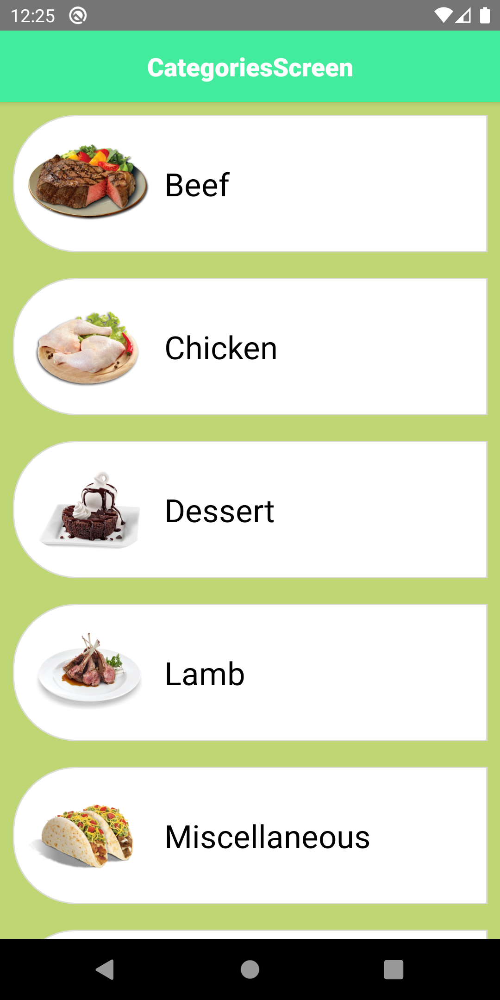
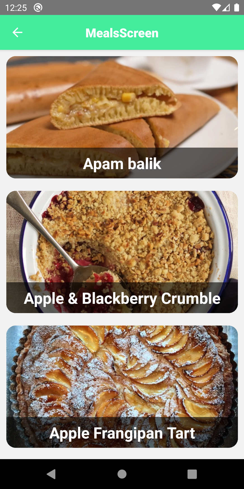
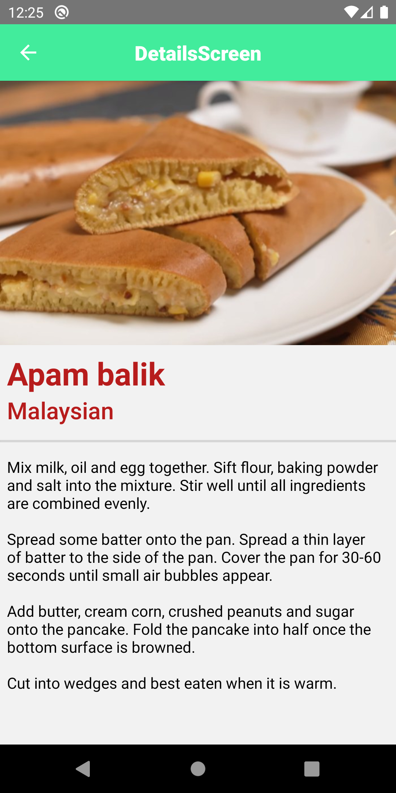

# Recipe App

  

## Setup

- [Install React Native](https://reactnative.dev/docs/environment-setup)

- Create a folder then `git clone <My Repository Adress>` to pull github repository

- npm install for installing all the dependencies

- start your emulator or connect your physical device then start npm run android/ios(depending on your device)

## Tools & Resources

- [TheMealDB](https://www.themealdb.com/api.php)
- [Lottie](https://github.com/lottie-react-native/lottie-react-native) for animation
- [React Navigation](https://reactnavigation.org/) for page hierarchy
- [React Native Config](https://github.com/luggit/react-native-config) for `.env` files
- [Axios](https://github.com/axios/axios) for data fetching

## Features

- Categories for recipes
- Loading status with animation
- Error status with animation
